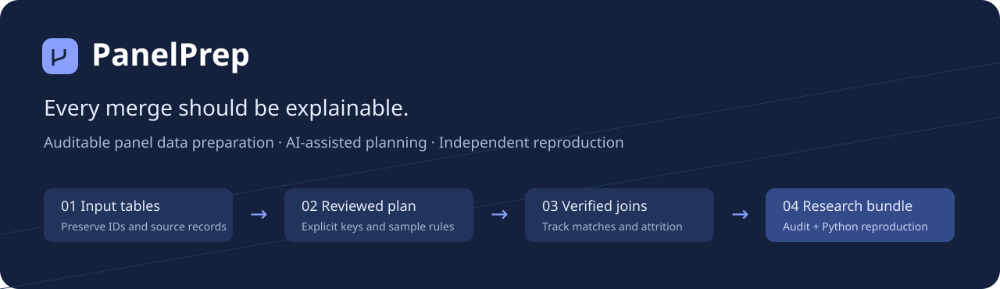

# PanelPrep · AI 辅助面板数据整理

[](https://github.com/Yangtao666China/panelprep-data-agent/actions/workflows/ci.yml)
[](LICENSE)

**把企业表、地区表和年度指标合并成研究数据，并解释每一条样本的去向。**

An auditable panel-data workbench: review an AI-proposed plan, execute explicit rules locally, and export an independently reproducible research bundle. No API key is required for the complete manual workflow.

[在线试用](https://yangtao-panelprep.klasmoga878.chatgpt.site) · [English](#english-quick-start) · [处理语义](docs/methods.md) · [隐私与 AI](docs/privacy.md) · [合成示例](examples/demo) · [贡献](CONTRIBUTING.md)

## 解决一个具体问题

“把企业年度财务表合并上地区 GDP，保留全部企业样本。”

地区表的 `地区 × 年份` 是否唯一？没有匹配到 GDP 的企业留下了吗？企业代码的前导零有没有丢？合并后多出的行从哪里来？PanelPrep 把这些决定变成**明确的方案、可检查的执行记录和可复跑的结果**。适合体量有限、键含义已知的年度研究数据整理。

## 可以做什么

| 任务     | 实际行为                                                    |
| -------- | ----------------------------------------------------------- |
| 导入多表 | 1–5 张 CSV / TSV；UTF-8 或 GB18030；保留文本和 ID 前导零    |
| AI 规划  | 自带 DeepSeek API key；只发送字段和汇总统计；返回可编辑草案 |
| 明确合并 | 左 / 内连接；一对一、多对一、一对多；违反关系时停止         |
| 样本审计 | 每步匹配、未匹配、移出、扩展、未使用辅助表记录              |
| 追溯来源 | 每条结果追溯至输入表原始记录；去重后保留所有来源            |
| 面板检查 | 实体 × 年份重复、无效年份、实体自身首尾年间缺口             |
| 明确清洗 | 按列去空格、显式缺失标记、整行去重、精确十进制倍率换算      |
| 独立复现 | CSV、离线 HTML 审计报告、JSON 方案和 Python 标准库脚本      |

AI 不直接执行代码或修改数据。模型输出先通过结构和字段校验，用户应用方案后还要点击运行；实际键关系由确定性程序验证。

## 三分钟试用

需要 **Node.js 22.13+（推荐 24）**。测试和独立复现另需 Python 3.10+。

```sh
git clone https://github.com/Yangtao666China/panelprep-data-agent.git
cd panelprep-data-agent
npm ci
npm run dev
```

打开 `http://localhost:5173`，页面自带合成示例：

1. 查看企业表与地区表的 `region + year` 多对一左连接。
2. 点击“运行整理与检查”，查看“结果与审计”。
3. 核对：**12 条企业记录 → 10 条匹配、2 条未匹配 → 仍保留 12 条**；辅助表有 1 条未使用；企业 `0001` 缺少 2022 年。
4. 点击结果行的来源按钮，再导出研究包。
5. 解压后运行 `python reproduce.py --output reproduced`，检查 `verification.json`。

也可以直接[下载合成示例研究包](https://github.com/Yangtao666China/panelprep-data-agent/raw/refs/heads/main/examples/panelprep-demo.zip)，无需启动网页即可体验复现。自己的 Excel 文件请先另存为 CSV UTF-8。首次导入替换示例；**刷新或关闭页面会清空工作区，请先导出**。

### 可选 AI 助手

在右侧输入自己的 DeepSeek API key 和整理目标，例如：

> 以企业表为主表，按地区和年份合并 GDP，保留所有企业记录。检查企业代码和年份是否唯一。不要删除或填补样本。

模型只收到表名、字段名、行数、不同值数、空值数、数字形式计数和空格计数，以及目标和当前方案；**不发送原始数据行**。密钥保留在页面内存，经本站接口转发给 DeepSeek，不写入研究包或浏览器持久存储。目标和字段名也可能包含敏感信息，请先查看页面展示的发送内容。模型调用使用你的 API 额度。

当前配置 `deepseek-flash`，固定官方端点。接口、失败处理与最多两次尝试经过模拟测试；**没有使用真实付费 API key 做模型端到端验收**。手动流程不依赖模型。

## 研究包里有什么

| 文件                              | 用途                                 |
| --------------------------------- | ------------------------------------ |
| `data.csv`                        | 保真结果；分析时显式按字符串读取 ID  |
| `data-excel-safe.csv`             | 疑似公式文本加前缀，供表格查看       |
| `report.html` / `audit.json`      | 离线审计报告 / 机器可读检查结果      |
| `plan.json`                       | 明确的清洗、连接和面板检查方案       |
| `lineage.json` / `unmatched.json` | 输出来源与两侧未匹配记录             |
| `parsed-inputs.json` / `inputs/`  | 解析后的输入快照；不是原文件字节备份 |
| `reproduce.py`                    | 独立 Python 执行与核对，无第三方依赖 |
| `expected.json` / `manifest.json` | 网页端期望结果、输入摘要与版本       |

复现核对列顺序、数据、逐行来源、样本变化、清洗统计和面板统计。哈希用于发现意外变更，不是签名或来源真实性证明。

## 范围和边界

- 单文件最多 10 MB、10 万行、200 列；总输入和结果分别最多 200 万单元格，结果最多 15 万行。处理与导出仍受本机内存限制。
- 只支持精确键匹配。缺失键永不互相匹配；不自动映射企业更名、地区调整或近似名称。
- 年份需为 1800–2200 的四位整数。缺口检查不证明全样本均衡或覆盖完整。
- 不自动填补、缩尾、聚合重复键或做多对多连接；不推断汇率、币种、财年或名义 / 实际值。
- 换算倍率由用户指定，不验证经济含义；结果列被换算后替换，原值保留在输入快照。
- 面板重复和缺口以警告保留；**处理完成不代表符合研究要求**。违反合并关系、非法换算等错误会阻止导出。
- 当前没有 XLSX、数据库连接、后台作业、账户历史或自动保存。

## 开发与验证

```sh
npm test
npm run typecheck
npm run build
npm run example
```

测试覆盖解析、键关系、精确数值、来源、输入限制、恶意文本、AI 模拟接口，以及网页 / Python 独立实现的一致性。CI 配置 Windows / Linux、Python 3.10 / 3.12；模拟测试不衡量 AI 建议的语义质量。

核心代码：`lib/panelprep.ts`（引擎）、`lib/agent.ts`（方案约束）、`app/api/plan/route.ts`（模型接口）、`lib/export.ts`（研究包）、`public/reproduce.py`（独立复现）。界面采用 React / TypeScript，基于 Sites 的 Vinext starter 和 shadcn/ui；整理在浏览器 Web Worker 运行。

本项目使用 AI 辅助开发，公开代码、测试与限制。它是可用的早期工具，尚未经外部审计或真实研究数据的大规模验证。欢迎提供匿名失败案例，帮助改进真实数据体验。

## English quick start

Run `npm ci` and `npm run dev`, then open `http://localhost:5173`. The UI currently uses Chinese; source and schemas are available for localization.

Start with the built-in synthetic firm-year example, inspect the explicit plan, run the checks, and export the research bundle. Run `python reproduce.py --output reproduced` inside the extracted bundle to independently compare results. No Python packages or model key are needed for this step.

The optional DeepSeek planner receives metadata, summary counts, your goal and the current plan, never raw rows. Its proposal requires review. Deterministic code enforces join cardinality, preserves sources and reports attrition. This release supports exact annual-panel preparation, not fuzzy entity resolution or economic identification checks.

MIT license, including synthetic demo data.
